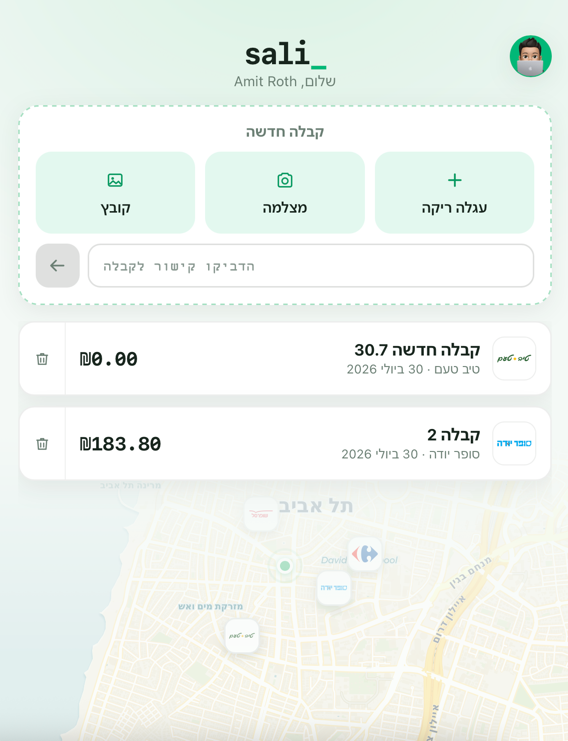
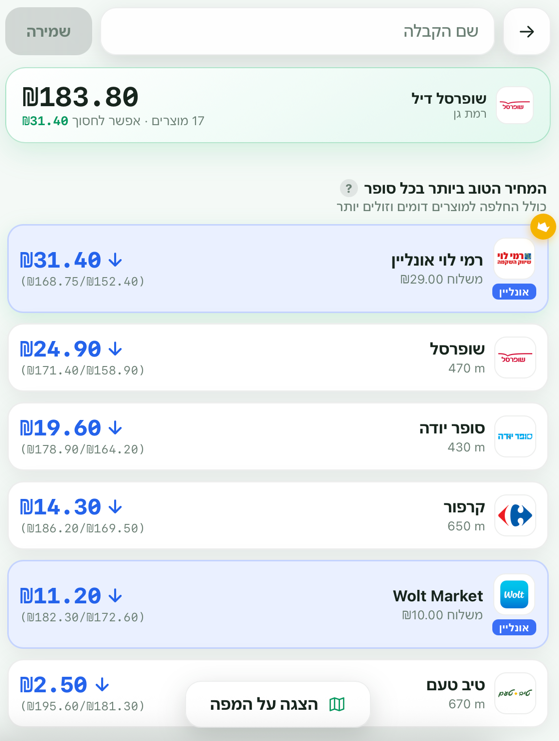
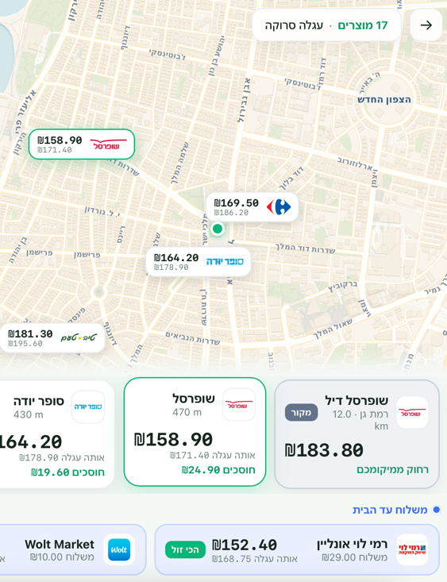

# sali

Analyze and compare supermarket prices. Compare shopping carts across stores and get recommendations for cheaper alternatives.

## Screenshots

| Home | Price comparison | Map |
|:---:|:---:|:---:|
|  |  |  |

## Data source

Prices are published under Israel's price transparency regulations:
https://www.gov.il/he/pages/cpfta_prices_regulations

## Setup

```bash
uv sync
cp .env.example .env
```

## Run

```bash
uv run sali
```

## API

Run the local FastAPI service in a separate terminal:

```bash
uv run sali-api
```

It listens on `http://localhost:8000`, with interactive docs at
`http://localhost:8000/docs`. The service stores nothing: receipt URLs, uploads,
and extraction results all live only for the length of the request.

There are two families of endpoints. **Extraction** turns a receipt into a
Receipt Document. **Cart comparison** takes that document and prices it across
supermarkets. The `compare-url` and `compare-image` endpoints do both in one
call.

| Method | Path | Takes | Returns |
| --- | --- | --- | --- |
| POST | `/api/receipts/extract` | receipt URL | Receipt Document |
| POST | `/api/receipts/extract-image` | receipt photo | Receipt Document |
| POST | `/api/receipts/extract-image-total` | receipt photo | total only |
| POST | `/api/carts/compare` | Receipt Document | ranked stores |
| POST | `/api/carts/compare-url` | receipt URL | ranked stores |
| POST | `/api/carts/compare-image` | receipt photo | ranked stores |
| GET | `/health` | — | `{"status":"ok"}` |

### Extraction

`POST /api/receipts/extract` reads a Digital Receipt from a public HTTPS link:

```bash
curl -X POST http://localhost:8000/api/receipts/extract \
  -H 'Content-Type: application/json' \
  -d '{"url":"https://merchant.example/receipt/public-token"}'
```

It returns a Receipt Document — merchant, transaction, reconciled totals, and
one entry per line item:

```json
{
  "schema_version": "1.0",
  "receipt": {
    "merchant": {"name": "סטופמרקט", "branch_name": "סניף ראשון לציון", "branch_number": null},
    "transaction": {"receipt_id": "12345", "purchased_at": "2026-07-28 19:04", "transaction_number": null, "type": "purchase", "currency": "ILS"},
    "totals": {"subtotal": "596.06", "discounts": "-23.00", "total": "573.06"},
    "items": [
      {"position": 1, "code": "7290000060200", "name": "קוטג' 5%", "categories": [],
       "quantity": "2", "unit": "unit", "unit_price": "7.90",
       "gross_total": "15.80", "adjustments": [], "final_total": "15.80"}
    ]
  },
  "warnings": ["missing: receipt.items[4].unit_price"]
}
```

`POST /api/receipts/extract-image` takes one `multipart/form-data` field named
`image` and returns the same shape, but only when every line item is readable.
When the photo supports the total and not a full cart, use
`POST /api/receipts/extract-image-total`, which returns just
`{"total", "currency", "warnings"}` and says outright that the cart is
incomplete:

```bash
curl -X POST http://localhost:8000/api/receipts/extract-image-total \
  -F 'image=@/path/to/receipt.jpg;type=image/jpeg'
```

Image endpoints accept JPEG, PNG, and WEBP up to 10 MiB. They do not accept
PDFs, HEIC, GIF, or multi-image receipts.

### Cart comparison

These endpoints answer the shopping question: **which stores stock everything I
bought, and which of those is cheapest?** A store missing any item is not a
cheaper option, so complete carts are ranked first, and stores missing something
are listed separately with the gap named.

Price the document you already extracted:

```bash
curl -X POST http://localhost:8000/api/carts/compare \
  -H 'Content-Type: application/json' \
  -d '{"document": <a Receipt Document>, "city": "תל אביב"}'
```

Or go straight from a link, or from a photo, in one call:

```bash
curl -X POST http://localhost:8000/api/carts/compare-url \
  -H 'Content-Type: application/json' \
  -d '{"url":"https://merchant.example/receipt/public-token","city":"תל אביב"}'
```

```bash
curl -X POST http://localhost:8000/api/carts/compare-image \
  -F 'image=@/path/to/receipt.jpg;type=image/jpeg' \
  -F 'city=תל אביב'
```

`city` is optional; omit it to rank every store in the country.

The response reports how each line resolved, then the ranking:

```json
{
  "schema_version": "1.0",
  "currency": "ILS",
  "receipt_total": "573.06",
  "matched": [
    {"position": 2, "receipt_name": "ביצים אורגני 12 יח", "receipt_code": "7290005271458",
     "quantity": "1", "paid": "24.90", "matched_by": "barcode", "confidence": 1.0,
     "product": {"product_id": "7290005271458", "barcode": 7290005271458,
                 "name": "ביצים אורגני 12 יח ג", "manufacturer": null}}
  ],
  "unmatched": [
    {"position": 51, "receipt_name": "מפעיל הנחה 100 שח למ", "receipt_code": "531",
     "paid": "0.00", "reason": "best name match scored 0.25, below the 0.50 confidence floor"}
  ],
  "complete_carts": [
    {"store_id": "s-nes", "store_name": "נס ציונה", "city": "נס ציונה",
     "address": "החרש 9", "chain_id": "7290875100001", "chain_name": "שופרסל",
     "complete": true, "priced_items": 44, "total_items": 44, "total": "962.86",
     "missing": [], "chain_level_estimate": false}
  ],
  "partial_carts": [
    {"store_id": "d-tlv", "store_name": "אלונית יגאל", "chain_name": "Dor Alon",
     "complete": false, "priced_items": 28, "total_items": 44, "total": "597.63",
     "missing": [{"barcode": 7290000060200, "name": "קוטג' 5%"}], "…": "…"}
  ],
  "warnings": ["uncertain: receipt.items[7] 'עגבניות' was priced as 'עגבניות שרי ארוז' on a name match scoring 0.50"]
}
```

Read it in this order:

- **`complete_carts`** — stores with a current price for every matched product,
  cheapest whole cart first. This is the answer.
- **`partial_carts`** — best coverage first, then price. A partial cart is
  always "cheaper" for the wrong reason, so it never outranks a complete one.
- **`unmatched`** — receipt lines with no catalogue product. They are excluded
  from every total, so a cart total is comparable between stores but is not the
  receipt total.
- **`warnings`** — anything a shopper should not have to infer, especially
  `uncertain:` lines, where a product was matched by name rather than barcode
  and could be the wrong variant.

### How matching works

Receipt lines are resolved to catalogue products barcode-first. A 12–14 digit
code printed on the receipt names the exact product, so that match is certain.
Weighed goods (produce, deli, bakery) carry a merchant-internal PLU instead,
which means nothing outside that chain — those lines fall back to a name search,
scored on token overlap, and a candidate below the confidence floor is reported
unmatched rather than priced as the wrong product.

On real receipts this resolves 50 of 51 lines for a supermarket shop (the
holdout being a discount-trigger line, which is not a product). A pharmacy
receipt resolves nothing, because those SKUs are not in a supermarket catalogue.

### Price database

Two deployments of the Open Supermarkets API exist, and **neither can answer the
question alone** — each has exactly what the other is missing:

| | `data.openisraelisupermarkets.co.il` | `34.165.235.189:8000` |
| --- | --- | --- |
| Auth | bearer token | none |
| Price listings | yes (when up) | **none** — `/health/pipeline` reports `totalChains: 0` |
| Store coordinates | **none** | yes, on every store |
| Coordinate search | — | `/stores/nearby?lat&lng&radius`, answers in milliseconds |

So the app reads **prices** from the first (`SALI_PRICES_API_URL`) and **map
pins** from the second (`SALI_GEOCODING_API_URL`), joining a branch across the
two on `(chainCode, storeNumber)` — the chain's GLN plus the branch number the
chain itself assigns. Both publish those, and together they identify a branch
independently of either one's internal ids. See `src/sali/nearby/stores.py`.

The join is partial: a branch the pricing instance does not list is still drawn
on the map, just without prices. That is the intended degradation — an unpriced
map is useful, an empty one is not.

#### Upstream reliability

The pricing instance is slow and frequently down. A single barcode lookup takes
about five seconds when healthy, and there is no bulk endpoint, so the client:

* runs lookups concurrently and caches them for the process,
* retries once, then tolerates a failure rather than failing the whole cart,
* and trips a **circuit breaker** after `CIRCUIT_BREAKER_THRESHOLD` consecutive
  failures, so a fifty-line receipt against a dead host costs one fast failure
  instead of fifty timeouts.

When nothing can be priced the response says so explicitly:

```
"no store prices: the price database has no current listings for any matched product"
```

#### Simulated prices (development only)

Because the price database is often unable to price anything at all, the
comparison screens can be run against **simulated** figures by setting
`SALI_FALLBACK_PRICES=1`. See `src/sali/nearby/fallback.py`.

**These are not real prices.** They are derived from the shopper's own receipt,
varied per store by a deterministic hash, purely so the screens have
plausibly-shaped data to lay out. This is off unless explicitly enabled; every
response it touches carries a `demo prices:` warning and every store it builds
is flagged `simulated: true`, and the UI renders a non-dismissible banner and
suppresses the savings celebration whenever it sees them.

Ranking against real data is exercised by `tests/cart_comparison/test_ranking.py`
and starts returning stores as soon as listings land — no code change needed.

### How URL extraction works

`POST /api/receipts/extract` opens the link in a local headless browser, hands
the model the page's markup, text, and a screenshot, and lets it call back for
more — clicking a control or asking for the unreduced HTML — when what it was
given is not enough. Receipt pages routinely keep their line items in a
collapsed section, so the markup is deliberately read before the browser paints
it. The extraction is then reconciled locally against the receipt's own
arithmetic, and a rejected attempt is retried against the same captured page
with more reasoning effort.

This needs Playwright's Chromium, which `uv sync` installs:

```bash
uv run playwright install chromium
```

Hosted browsing remains as a fallback for when no local browser is available.
It cannot open most merchant receipt links, which are short opaque tokens
pointing at client-rendered pages.

### Failures

Every error response carries a `request_id`:

```json
{"error": {"code": "extraction_unavailable", "message": "…", "request_id": "8a41c2b0e7d5"}}
```

The same id is written to the server log with the failure code and the field
paths that failed reconciliation, so a report can be traced without exposing
receipt content to the caller. Model- and page-derived failure text is withheld
from logs by default because it quotes the merchant page; set
`SALI_LOG_FAILURE_DETAIL=1` to include it while debugging locally.

| Status | `code` | Means |
| --- | --- | --- |
| 422 | `invalid_request` | The body did not carry the URL, image, or document the route needs |
| 422 | `invalid_url` | Not a public HTTPS link |
| 422 | `invalid_image` | Not a JPEG/PNG/WEBP under 10 MiB |
| 422 | `not_receipt` | The link or photo was not a receipt |
| 422 | `insufficient_evidence` | A receipt, but not enough of one to extract |
| 422 | `blocked` / `unreachable` / `refused` | The receipt could not be accessed or processed |
| 503 | `extraction_unavailable` | Extraction failed after its retries |
| 503 | `price_database_unavailable` | The Open Supermarkets API could not be reached |

Note that failing to match products, or finding no store that stocks the cart,
is **not** an error: those come back 200 with `unmatched` and `warnings`
populated, because they are answers a shopper can act on.

## Configuration

| Variable | Default | Purpose |
| --- | --- | --- |
| `OPENAI_API_KEY` | — | Required for every extraction endpoint; read from the process or `.env` |
| `SALI_PRICES_API_URL` | `https://data.openisraelisupermarkets.co.il` | The Open Supermarkets instance prices are read from |
| `SALI_GEOCODING_API_URL` | `http://34.165.235.189:8000` | The instance store coordinates are read from |
| `SUPERMARKET_API_KEY` | bundled public token | Bearer token for the pricing instance |
| `SALI_FALLBACK_PRICES` | unset | Set to `1` to simulate prices when the database is down — **development only, not real prices** |
| `SALI_STORE_DIRECTORY_TTL_SECONDS` | `21600` | How long the cross-instance pricing index is cached |
| `SALI_CORS_ORIGINS` | `http://localhost:5173` | Comma-separated browser origins allowed to call the API |
| `SALI_LOG_FAILURE_DETAIL` | unset | Set to `1` to log model- and page-derived failure text while debugging |

## UI

Mobile-first React app in `ui/` (upload a receipt → compare the cart across nearby stores).
Selecting or dropping a supported receipt image calls the local total-only API
and shows the extracted receipt total. Cart comparison still uses the sample
cart in `ui/src/resources/`.

```bash
npm install --prefix ui
```

```bash
npm run dev --prefix ui
```

Then open http://localhost:5173.

For local receipt extraction, run the API at `http://localhost:8000`.

### Auth & saved receipts (Supabase)

The UI runs without Supabase — sign-in is faked and receipts stay in `localStorage`.
To enable real Google sign-in and cloud-persisted receipts:

1. Copy `ui/.env.example` to `ui/.env.local` and fill in `VITE_SUPABASE_URL` and
   `VITE_SUPABASE_ANON_KEY` (Supabase → Settings → API). Only publishable keys belong
   here — anything `VITE_*` ships inside the browser bundle.
2. Run `docs/supabase-setup.sql` in the Supabase SQL editor to create the `receipts`
   table and its row-level-security policy.
3. Supabase → Authentication → Providers → enable **Google**, using a Google Cloud
   OAuth client whose redirect URI is the one Supabase shows on that page.
4. Supabase → Authentication → URL Configuration → add `http://localhost:5173` to the
   allowed redirect URLs for local development.
